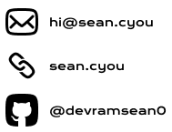

# 30th of June 2025
I actually got this idea Yesterday, But I didn't work on it. Basically I want a little 6502 powered conference badge with important info about me.
Such inclusions include:
- Name
- Email
- Website

As far as little interactive elements, I wanted some LEDS that go around the outside.
Kinda like

But with 8 LEDs instead of 6 (for all 8 data lines obviously... Or is it 7? do you count from 0 to 7 or 1 to 8, hmmm)

I also wanted to make life significantly harder on myself, as I wanted to use OSHParks super freaking cool [After Dark](https://docs.oshpark.com/services/afterdark/) PCB stuff, which limits you to 2 copper layers.
And obviously the traces need to look good because like they are on display

Now, to decide on a layout for my information I opened up a figma and just started putting text down :)

All Icons are from [@hackclub/icons](https://icons.hackclub.com) because while limited in selection, I prefer them.

## First Attempt:

While I enjoyed the simplicity of this approach, I decided to redesign because:
a) It doesn't really describe me and my personality
b) It would very easily get lost in the busyness of the camp.

## Second Attempt

The main differences are:
- Centering
- Little invitational text
- A row of icons describing my hobbies and major features (rainbow = lgbtq, code = programming, image = photography)

I wanted a ring of icons, but I ran out of things that describe me 😭, and I'm much happier with this anyway (it's not like anyone will look tbh)
