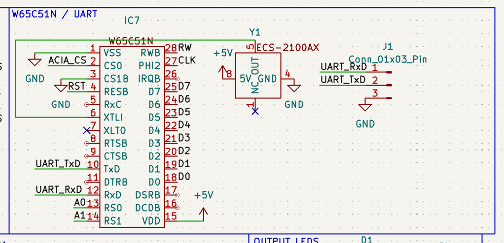
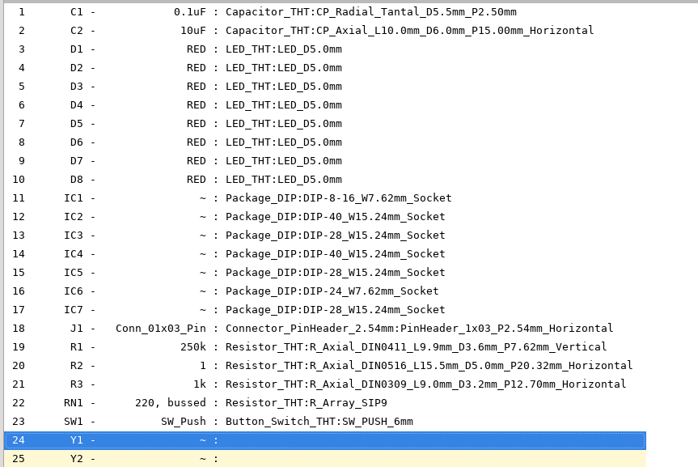

# 30th of June 2025
I actually got this idea Yesterday, But I didn't work on it. Basically I want a little 6502 powered conference badge with important info about me.
Such inclusions include:
- Name
- Email
- Website

As far as little interactive elements, I wanted some LEDS that go around the outside.
Kinda like

But with 8 LEDs instead of 6 (for all 8 data lines obviously... Or is it 7? do you count from 0 to 7 or 1 to 8, hmmm)

I also wanted to make life significantly harder on myself, as I wanted to use OSHParks super freaking cool [After Dark](https://docs.oshpark.com/services/afterdark/) PCB stuff, which limits you to 2 copper layers.
And obviously the traces need to look good because like they are on display

Now, to decide on a layout for my information I opened up a figma and just started putting text down :)

All Icons are from [@hackclub/icons](https://icons.hackclub.com) because while limited in selection, I prefer them.

## First Attempt:

While I enjoyed the simplicity of this approach, I decided to redesign because:
a) It doesn't really describe me and my personality
b) It would very easily get lost in the busyness of the camp.

## Second Attempt

The main differences are:
- Centering
- Little invitational text
- A row of icons describing my hobbies and major features (rainbow = lgbtq, code = programming, image = photography)

I wanted a ring of icons, but I ran out of things that describe me 😭, and I'm much happier with this anyway (it's not like anyone will look tbh)

# 1st of July 2025

Now that I know what the center looks like and a bit of my specs, I can start working on the Schematic.
This is optimised for looks and size over price.

I also realised that I need to provide a 5V voltage rail for my chips, To do this, I settled on a 9V battery and then voltage regulating it down to 5V. I'll leave the battery holder off the PCB since this is a pin badge of sorts

The specific parts I have gone for are:
- W65C02 (CPU)
- W65C22S6TPG (VIA)
- AT28C256 (EEPROM/ROM)
- AS6C62256 (RAM)
- Red LEDs
- 1Mhz Clock IC

I however need to size my Voltage regulator properly, to do this I found the datasheets for all my parts and started adding!

CPU: 1.5mA (I think?)
VIA: 0.5mA
ROM: 10mA
RAM: 15mA

So like, not too bad and a 150mA regulator should easily be able to do it.
Specifically I chose the [TPS7250QP](https://www.mouser.co.uk/ProductDetail/Texas-Instruments/TPS7250QP) because it's the closest equivalent that mouser had. Although I'm not a fan of the number of support components

The Typical Application Configuration is below:

Meaning it needs 2 resistors and 2 capacitors.

I had to go footprint and symbol hunting for the TPS7250QP. I could have done it myself but then I'll be forever doubing my choice of footprint.

I now need to go hunting for 6502 symbols because Kicad doesn't already have one. But I will probably just make them myself as it's a standard DIP

# 2nd of July 2025
Time to actually do the basic 6502 routing (connecting all the correct pins to power and ground and stuff)

Specifically this involves the following baseline connections for the CPU to work:
- VDD
- VSS
- RDY (Ready) - Needs to be High for the CPU to be enabled
- BE (Bus Enable) - Needs to be High for the CPU to output data on the bus
- SOB (Set Overflow) - Not recommened for new designs, so is held high as the datasheet suggests.
- RESB (Reset) - Should be held high, but pulled low to reset. This is done with a 1k resistor to 5V and a button to GND in my design

I also decided to redesign the Voltage Regulator as the messyness of the symbol was really annoying me :sob:) 

And after a little bit of reorg, I got this! (Isn't this so much more readable :p)

At this point, I decided just to make all my IC symbols myself. This made the process more challenging, but also meant that it would be consistent as I doubt KiCad has pre-baked symbols for these chips.

Like this one for the AT28C256 ROM chip:

As part of the ROM element of the design I also needed a NAND gate to help with memory addressing. I chose the SN74HC00N for this due to it's low cost and high avaliability at Mouser.\
I elected not to make a custom symbol for this, as the Kicad one is sufficient.

The for-now completed ROM circuitry looks like:

I would also like to point out that I have downloaded any datasheets for chips used to the Datasheets directory in this repo.

So, we now have the CPU and the Program Storage. Next, we need our outputs and inputs.
To do this, I am going to use a VIA (Versatile Interface Adapter). This is the chip I found earlier, and will handle the memory addresses and data lines and stuff like that.

I do need to make my own footprint though.

I chose to follow Ben Eaters Advice on not being overly selective on memory addresses, This is because the only other bus device I need is the RAM in this case, and it saves significant cost and space which is important for the badge)

And minus the LEDs and buttons, this is the VIA design!

And here's a little progress check of the schematic and time:\
\
The total time I have spent on it so far is: 4h 50mins

The next job was to add the 8 LEDS to the VIA, this was obviously very easy, it's just 8 LEDS and resistors.
I then had a thought, What if I use a resistor network, and significantly cut down on the space requirement. Which is what I did

And now for that final BUS device, the RAM chip. I chose the AS6C62256 because it's a known quantity with the 6502.

The footprint I cooked up is below\

I also fixed an issue where I accidently connected VSS to 5V and VDD to GND where they should be reversed on the VIA

I then realised that there are a few issues with my current design:
- It is becoming too big and heavy for a pin badge
- It is pretty much identical to Ben Eaters design, in both theory and schematic
- There isn't anything unique or exciting about it.

To solve this issue (after talking to Marios on the HC Slack), I came up with the following idea:
- Move to a lanyard form factor/design (also allowing me to stick the 9V battery to the back)
- Try and add a i2c device like a temp probe, or a adc for like a photoresistor to the design)

And to be clear, I've been trying to learn from the datasheets as I go, but they don't cover information like address ranges and such and I'm new to all of this.

# 3rd of July 2025
## Time for some fundamentals
After yesterdays revelations, I set out to actually learn more of the fundamentals behind my design.

After a bit more watching, This is roughly how the current memory address space works:

As you can see, there are 2 address spaces that are unused. For the simplicity requirements of Ben's design, it makes perfect sense (due to the reduction in gates and therefore size) however, I think I can make some changes to remove the following "restrictions"
- Half the RAM chip is unusable, which could limit the program executions (although unlikely)
- The address alocation is based on gates not efficiency

However, there are also some benefits:
- ROM being at the top makes lots of sense compared to alternatives
- RAM being at the bottom makes lots of sense for efficiency and similar reasons to the ROM.

What I'm instead suggesting is that I use some form of PLD for address decoding, This would allow me to achieve a memory map like:

(Key differenciator being more RAM space, but would also allow me to reprogram the address space if and when I need it, giving me more flexibility.
I also chose to leave some address space unused still because I want to try and connect an i2c device like a temp probe or similar, but have not looked into the requirements yet.

## The rest
Okay, so I finished up the RAM setup using the static address spacing.

I then went looking for CPLD or similar device, and after searching "connecting a CPLD to a 6502" I got suggested [this article](https://www.hackster.io/michael-cartwright/address-decoding-for-6502-using-a-pld-0d72ee), which suggests using the Microchip ATF22V10C. Specifically the 7.5ns delay version.
I found this chip for 2.39 GBP on Mouser, which while more than the NAND gates is not significantly more considering the flexibility it provides.

It is also really freaking easy to setup which is nice. but ofcourse no symbol exists by default (because why would it :heavysob:)

It even has enough IO for all the address lines, not just A2 -> A15, with 5 outputs. 

So I also tidied up the logic gates around.

# 4th of July 2025

As I discussed originally, I wasn't going to add a serial port, however, adding one opens up interesting paradims for dynamically changing patterns.
To do this, I just added a ACIA (W65C51N) without any of the voltage manipulation logic, as I'm planning to use UART instead of full RS232 for simplicity.

I tied Chip Select 1 straight to GND, as the chip will be active when low, and since I have more granular control over my Chip Select 0, I can correctly toggle it anyway.
I also debated some kind of onboard UART to USB adapter, but I do need to start being aware of the pure chip cost associated with this project. At this point I also decided to switch to more of a lanyard shape due to the weight.

A bit of tinkering with the chip later, I got:

At this point I had (another) interesting idea, What if I embed a UART to USB chip directly on my board. This should have minimal cost of about 2 GBP, but makes it much more portable for a field.
I found thee MCP2221 chip which meets these requirements, but I'm not quite sure how to wire it up, and since it's a stretch goal anyway, I'm not going to touch it.

Now, I just realised that I forgot my clock :facepalm:

This was really simple, and I chose to use the ECS-100A-010, The slow speed is a feature as it means I need to do less of my own delay logic so the LEDs don't give seizures or anything.

And since it doesn't require anything special, we can just connect 5v, GND and out.

Next steps are to double check any other wiring. 
I discovered that I wasn't properly holding my Interrupt pin high, so I connected it to my UART chip.

Now, I'm going to work on assigning footprints. I need Wide DIP sockets, and through hole capacitors and resistors.

# 5th of July 2025
I couldn't find a compatible footprint for my 1.8432Mhz crystal, so I went looking for a different part on Mouser (and found one!). Specifically, I had to switch from a crystal to a clock oscillator.

If we look at the W65C51N datasheet (the UART/ACIA chip), they suggest 2 different clock options:

Which suggests that I can connect a clock oscillator just to the XTLI pin on the chip, This also has the sideaffect of meaning I need less passives (yay).

And it's a little cursed, but here's the fixed schematic

I've been having issues finding through hole passives because of the various different sizes and the limited selection avaliable at many retailers.

Is what I have so far, I'm struggling to find a 10uF Through Hole Tantylum (required by the voltage regulator).

I did eventually find a capacitor that met my requirements (through hole, 10v) but it was almost 2 GBP on mouser. Specifically it's the [173D106X9020WWE3](https://www.mouser.co.uk/ProductDetail/Vishay-Sprague/173D106X9020WWE3?).
This took a good while of searching.

Phew, almost there, just need the clocks now.

I went and just got the mouser footprints for the clocks because I couldn't find the footprints on Kicad. 

AND DONE

I have also now begun the process of layout for a lanyard style design, Specifically I have laid out the output chips, the clocks and output LEDs.

And after a bit more work, I got my address lines feeding into both my CPU and address decoder, next step is data lines and clocks and intterupts and stuff.

Despite yaknow not actually finishing the routing, I decided to start messing with the fill zones.

1. 
2. 
3. 
4. 
5. 

I have however ran into an issue with routing, which means It may be a good idea to uh start again from scratch with the routing and parts placement.

